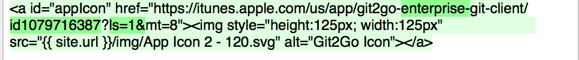
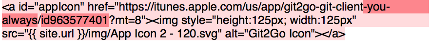

# JSDiff

[](https://travis-ci.org/nerdishbynature/JSDiff.swift)
[](https://codecov.io/github/nerdishbynature/JSDiff.swift?branch=master)

A Swift wrapper around [JsDiff](https://github.com/kpdecker/jsdiff).

## Installation

Carthage is currently the only supported installation method:

```
github "nerdishbynature/JSDiff.swift"
```

## Usage

### Diffing words

Simply put your desired colors into the `JSDiff` initializer where `deletedColor` is the lighter color and `deletedWordColor` is the one that should be more prominent (see the example image).

This method will result a `JSLineDiff` which has 2 attributed strings containing the diff.

```swift
let oldLine = "... something"
let newLine = "..."

let jsDiff = JSDiff(deletedColor: UIColor.deletedColor(), deletedWordColor: UIColor.strongDeletedColor(), addedColor: UIColor.addedColor(), addedWordColor: UIColor.strongAddedColor())

let result = jsDiff.diffWords(oldLine, newLine: newLine)
oldLineLabel.attributedText = result.oldLine
newLineLabel.attributedText = result.newLine
```




## License

See [LICENSE](LICENSE) file for more details
